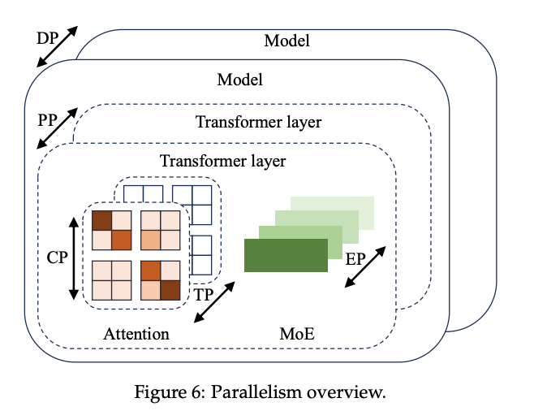
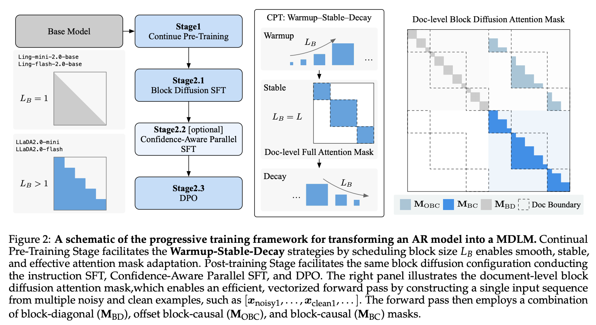
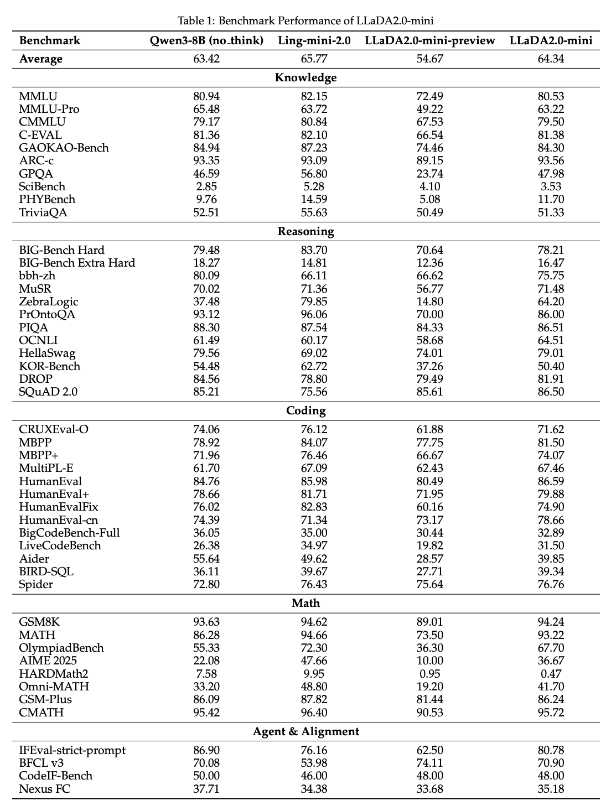
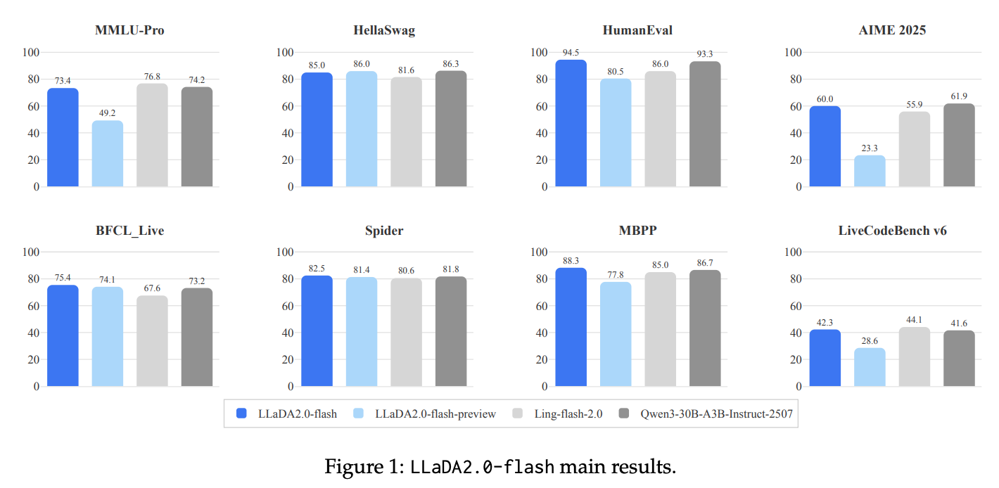
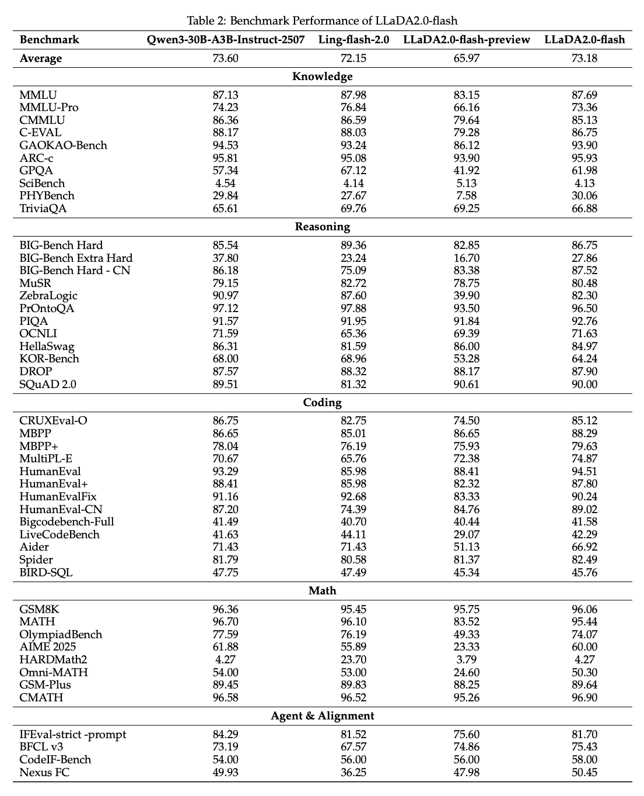
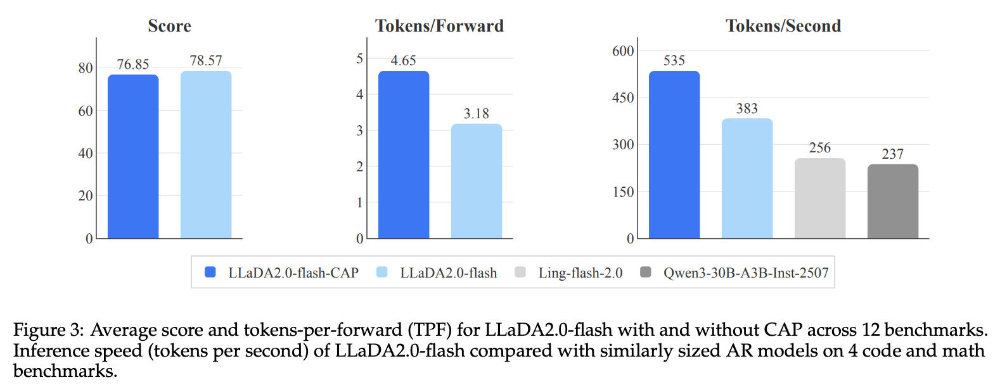
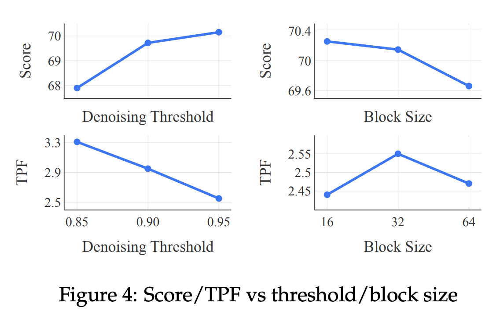
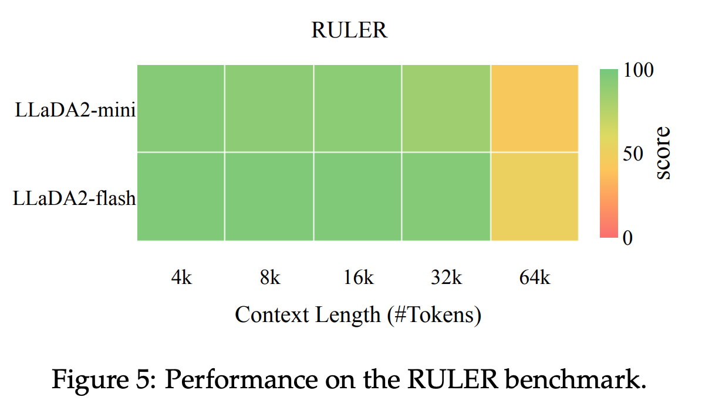

# 問題設定 (1)

- 拡散型言語モデル (dLLM) は自己回帰モデル (ARM) に対する有望な代替パラダイムだが、実用規模への拡張が未実証だった
  - LLaDA 1.0 など既存 dLLM の最大規模は 8B止まり
  - フロンティア規模（数十B〜100B）での有効性が不明
- ゼロから 100B の dLLM を学習するのはコスト的に非現実的
  - ARM として既に学習済みの大規模チェックポイントが大量に存在する
  - これを有効活用する変換手法が必要

---

# モチベーション (1)

- ARM の逐次生成という構造的制約が推論速度のボトルネックになっている
  - 1 トークンごとに前トークン全体への依存が発生し、並列化が困難
- dLLM は複数トークンを同時にデノイズできるため、並列生成に理論的優位性がある
- 一方、ARM チェックポイントは **単方向 causal attention** で学習されており、双方向 attention を前提とする拡散目的関数と構造的に整合しない
  - この変換をどう安定させるかが本研究の核心的課題

{width=78%}

---

# 先行研究 (2)

- **dLLM のスクラッチ学習**: LLaDA 1.0、MDLM、Plaid など
  - 8B 以下での有効性は示されているが、それ以上のスケールは未検証
- **AR 初期化からの変換**: 既存研究はごく小規模（数百M〜1B）に留まる
  - 本研究は変換の対象を **16B・100B MoE** まで拡張する初の試み
- **dLLM の事後学習**: SFT 相当の手法は一部提案されているが、DPO 等の preference alignment は未開拓

---

# 新規性 (3)

LLaDA 2.0 の新規性は一言で言えば、**既存の ARM チェックポイントを安定的に dLLM へ変換するための 3 段階 WSD 学習スキームの確立**である。加えて以下の技術的貢献が組み合わさっている。

- **3 段階 WSD (Warmup-Stable-Decay) 変換戦略** — ブロックサイズを段階的に拡大・縮小し、ARM から dLLM へ知識を引き継ぐ
- **Document-level Attention Mask** — 複数文書パッキング時の文書間情報漏洩を防ぐ
- **Top-k Checkpoint Merging** — 上位 k チェックポイントのパラメータ平均化で汎化性能を安定させる
- **CAP (Confidence-Aware Parallel) Training** — 並列デコード品質を落とさずに推論を高速化
- **拡散モデル向け DPO** — ELBO ベースの preference alignment を実現

---

# アイデア：WSD 変換戦略 (4.1)

ARM チェックポイントは「ブロックサイズ=1 の Block Diffusion LM」と解釈できる。ここからブロックサイズを段階的に拡大・縮小することで ARM → dLLM の変換を実現する。

**Warmup フェーズ**: ブロックサイズを 1 → 4 → 32 → 64 → 4096 と段階的に拡大
  - ARM の知識を保ちながら双方向 attention の能力を徐々に獲得

**Stable フェーズ**: ブロックサイズを 4096（全系列長）に固定
  - 標準的な Masked Diffusion LM (MDLM) として大規模データで学習
  - Causal attention 部分を廃棄し計算効率を向上

**Decay フェーズ**: ブロックサイズを 4096 → 2048 → 32 と段階的に縮小
  - 推論効率に最適化された compact なブロック拡散モデルへ収束

---

# アイデア：WSD 変換戦略 (4.1)

{width=60%}

---

# 提案手法：学習目的関数 (4.1)

**Block Diffusion LM の損失関数**

$$
\mathcal{L}_{\text{BDLM}}(\theta) = -\mathbb{E}\left[\frac{\alpha'_t}{1 - \alpha_t} \sum_k^K \sum_i^{L_B} \mathbf{1}[x_{t,k}^i = \text{[MASK]}] \log p_\theta(x_{0,k}^i \mid x_{0,<k},\ x_{t,k})\right]
$$

- $x_{0,k}$: 第 $k$ ブロックのクリーン系列
- $x_{t,k}$: 拡散時刻 $t$ でノイズを加えた第 $k$ ブロック
- $x_{0,<k}$: 第 $k$ ブロック以前の全クリーンブロック（causal context）
- $L_B$: ブロックサイズ
- $K$: ブロック数 ($= L_{\text{total}} / L_B$)
- $\alpha_t$: ノイズスケジュールパラメータ

Stable フェーズでは $k=1$（全系列が 1 ブロック）となり、標準 MDLM の目的関数に帰着する。

---

# 提案手法：Document Mask と Checkpoint Merge (4.2, 4.3)

**Document-level Attention Mask (4.2)**

- 複数文書を 1 系列にパッキングする際、双方向 attention が文書間で情報漏洩を引き起こす
- ブロック対角・オフセットブロック因果・ブロック因果の 3 成分からなる attention マスク $M \in \{0,1\}^{2L \times 2L}$ を構築
- 文書内のみ双方向 attention を適用し、文書間の依存を遮断する

**Top-k Checkpoint Merging (4.3)**

- WSD 事前学習後、validation perplexity 上位 $k$ チェックポイントを選択
- それらのパラメータを算術平均でマージ
- 事後学習への初期化として、単一ベストチェックポイントより安定した性能を示す

---

# 提案手法：事後学習 (5.1–5.3)

**SFT with Complementary Masking (5.1)**

- 同一データに対し通常マスクと反転マスクを両方適用し、学習データの有効利用を 2 倍に
- 100B トークン未満の小規模コーパスで効果的

**CAP Training (5.2)**

- 正解予測トークンの確信度を高める補助損失 $\lambda \cdot \mathcal{L}_{\text{conf}}$ を SFT 損失に加算
- 推論時に複数トークンを並列デコードしても品質が劣化しにくくなる

**Adapted DPO (5.3)**

- ARM 向け DPO は系列の正確な対数尤度を必要とするが、拡散モデルでは計算不可
- 対数尤度を **ELBO** で置き換えることで preference alignment を実現
- 約 150 万の preference ペアで学習

---

# 実験設定 (6.1)

- **ベースモデル**: InclusionAI の ARM MoE チェックポイント Ling-mini-2.0 (16B) と Ling-flash-2.0 (100B)
  - いずれも 20T トークン超で事前学習済み
- **評価ベンチマーク**: 5 次元 47 タスク
  - Knowledge (10): MMLU, C-EVAL, GPQA, ARC など
  - Reasoning (12): BBH, HellaSwag, SQuAD 2.0 など
  - Coding (13): HumanEval, MBPP, MultiPL-E, LiveCodeBench など
  - Math (8): GSM8K, MATH, OlympiadBench, AIME 2025 など
  - Agent & Alignment (4): BFCL v3, IFEval, CodeIF-Bench, Nexus
- **比較対象**: Qwen3-8B (mini 比較)、Qwen3-30B-A3B (flash 比較)

---

# 実験結果：LLaDA2.0-mini (16B) vs. Qwen3-8B (6.2)

- **全 47 タスク平均**: **64.34**（Qwen3-8B: 63.42）
- **代表スコア**: MMLU 80.53, HumanEval 86.59, GSM8K 94.24, IFEval-strict 80.78

- 総パラメータ 16B、実活性化は **約 1.4B のみ**にもかかわらず Qwen3-8B（8B dense）を平均スコアで上回る
- Coding と一部 Reasoning ベンチで優位

{width=80%}

---

# 実験結果：LLaDA2.0-flash (100B) vs. Qwen3-30B-A3B (6.2)

- **全 47 タスク平均**: **73.18**（Qwen3-30B-A3B: 73.60）
- **代表スコア**: HumanEval **94.51**, MBPP **88.29**, MultiPL-E **74.87**, BFCL v3 **75.43**

- 100B 総パラメータ（実活性化 約 6.1B）で、全 47 タスク平均では Qwen3-30B-A3B に **0.42 pt** 届かない
- Coding（HumanEval, MBPP, MultiPL-E）と Agent（BFCL v3）で一貫して上回る

{width=82%}

---

# 実験結果：LLaDA2.0-flash 詳細表 (6.2)

{width=78%}

---

# 実験結果：推論速度 (6.3)

8×H20 GPU (TP8) 上での throughput 比較。

- LLaDA2.0-flash-CAP: **535 TPS**（構造化タスクで最大 935 TPS）
- LLaDA2.0-flash（標準）: 383 TPS
- Ling-flash-2.0（ARM）: 256 TPS / Qwen3-30B（ARM）: 237 TPS

- CAP variant は同規模 ARM 比で **2.1 倍**の throughput を達成
- cuDNN attention backend の採用によりエンドツーエンドで **1.3 倍**速化、メモリ使用量 **90% 削減**

{width=86%}

---

# アブレーション：推論ハイパーパラメータ (6.3)

- **ブロックサイズの影響（mini）**: 16 は最高スコア 70.26 だが遅い（TPF 2.44）、32 は 70.15 / 2.55 でバランス、64 は高速だが品質劣化
- **デノイズ閾値の影響**: 0.85 は最速（TPF 3.31）だが品質低下、0.95 は 70.15 / 2.55 で推奨設定
- 結論として、ブロックサイズ 32・閾値 0.95 が品質と速度のトレードオフで最適

{width=80%}

---

# 制限 (8)

- **ネイティブコンテキスト長 32k を超えると性能劣化**: YaRN で 64k まで拡張可能だが、顕著な精度低下が生じる
- **複雑な推論タスクでの差**: 強力な ARM ベースラインとの差が残るタスクがあり、今後の課題
- **専用インフラへの依存**: cuDNN attention backend、dInfer エンジンが必要で、汎用フレームワークでの再現は非自明
- **Complementary Masking の適用範囲**: 事後学習（小規模コーパス）でのみ有効で、100B トークン超の大規模事前学習では効果なし

{width=70%}

---

# 今後の方向性（8）

- 100B を超えるスケールへの拡張
- 拡散モデル向けの強化学習・テスト時推論（test-time thinking）
- 64k 以上のコンテキスト長拡張

---

# まとめ

- LLaDA 2.0 は **ARM チェックポイントから dLLM へ変換する WSD 戦略**を確立し、拡散型言語モデルを初めて 100B 規模へ到達させた
- LLaDA2.0-mini (16B) は Qwen3-8B を平均で上回り、LLaDA2.0-flash (100B) は Qwen3-30B-A3B に平均 **0.42 pt** 差まで迫る
- CAP Training と専用推論エンジンの組み合わせで、同規模 ARM に対して **2.1 倍の推論速度**を実現
- dLLM がフロンティアスケールでも実用的な選択肢となり得ることを初めて実証した

---

# 参考情報

1. Bie, T., Cao, M., Chen, K., et al. (2025). LLaDA2.0: Scaling Up Diffusion Language Models to 100B. *arXiv preprint arXiv:2512.15745*.
2. Nie, S., Zhu, F., Liang, Z., et al. (2025). Large Language Diffusion Models (LLaDA). *arXiv preprint arXiv:2502.09992*.

---
