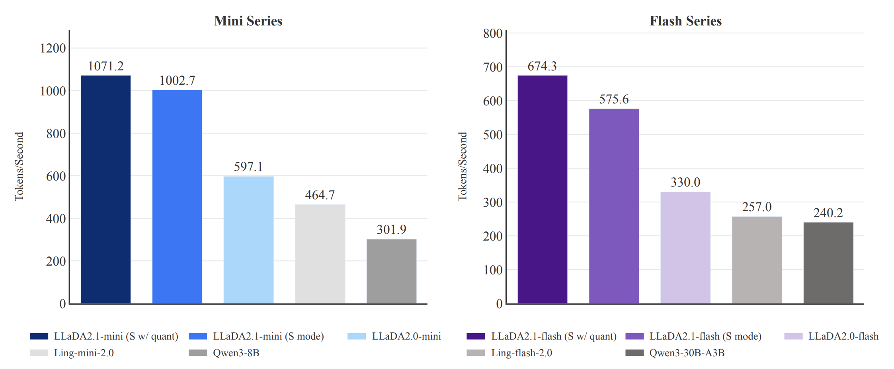

# 問題設定 (1)

- LLM推論の主流は **Autoregressive (AR)** デコーディング：1トークンずつ逐次生成
- **Discrete Diffusion LM (dLLM)** はマスクを並列に予測することで高速化を目指す
- しかし dLLM は **速度と品質のトレードオフ** を抱えている
  - ステップ数を増やすと品質は AR 並みだが速度優位が消える
  - ステップを減らすと品質が劣化する

**本論文の問いかけ：このトレードオフを根本から解消できるか？**

---

# モチベーション (1)

**現在の Mask-to-Token (M2T) デコーディングの3つの問題**

1. **Exposure Bias**：訓練はきれいなマスク列に対して行われるが、推論では部分的に予測済みのノイジーな列を受け取る → エラーが蓄積する
2. **Stuttering（n-gram反復）**：位置ごとに独立にサンプリングするため、同じトークンが繰り返されやすい
3. **修正不可能性**：一度配置したトークンは後から訂正できない

→ 既存手法（ReMDM, Prophet など）は訓練なしのパッチ適用にとどまり、根本解決になっていない

---

# 先行研究 (1)

| 手法 | 特徴 | 限界 |
|------|------|------|
| LLaDA (2025.02) | dLLM 8B、AR と同等品質 | ステップ数 = 応答長が必要 |
| LLaDA2.0 (2025.12) | 100B MoE に拡張 | M2T のまま、速度問題は未解決 |
| ReMDM / Prophet | 低信頼度トークンの再マスク | 訓練なしパッチ、100B 未検証 |

**共通の課題**：一度置いたトークンを **書き換える** 訓練目的関数が存在しない

---

# 新規性 (1)

**LLaDA2.1 の貢献（1文で）**

> 既に確定したトークンを推論中に書き直す **Token Editing** の訓練目的を導入し、速度と品質を同時に改善した最初の大規模 dLLM

**3つの貢献**

1. **Draft-and-Edit パラダイム**：M2T 展開とトークン上書きを同一ステップで実行
2. **統一訓練目的（M2T + T2T）**：書き直しを学習させる新しい目的関数と Multi-turn Forward (MTF) データ拡張
3. **EBPO**：dLLM スケール（100B）で初めて成功した RL フレームワーク

---

# アイデア (3.1)

**Token Editing の直感**

従来のM2Tデコーディング：`[MASK]` → トークン（一方向、不可逆）

LLaDA2.1 のデコーディング：各ステップで **2種類の更新集合** を動的に決定

- **Unmasking Set $\Gamma_t$**：信頼度 $\tau_{\text{mask}}$ を超えた `[MASK]` 位置を確定
- **Editing Set $\Delta_t$**：すでに確定済みだが、モデルの予測が現トークンと **異なり**、かつ信頼度 $\tau_{\text{edit}}$ を超えた位置を上書き

$$\text{更新位置} = \Gamma_t \cup \Delta_t$$

→ 並列展開しながら自己訂正が可能になる

{width=92%}

---

# 提案手法：訓練 (3.2)

**2ストリームの統一訓練目的**

- **M2T ストリーム**：従来通り、マスクから正しいトークンを生成（初稿作成能力）
- **T2T ストリーム**：ランダム置換でノイズを与えた入力から正しいトークンを復元（自己訂正能力）

**Multi-turn Forward (MTF) データ拡張**

訓練中に「中間編集状態」のシーケンスを生成し、多様な (初稿, 修正目標) ペアを学習 → 実際の推論過程に近い状況に対処できるようにする

→ アーキテクチャの変更は **不要**。訓練目的の変更だけで実現

---

# 提案手法：推論とRL (3.3–3.4)

| モード | $\tau_{\text{mask}}$ | 特性 | 向いているタスク |
|--------|---------------------|------|-----------------|
| S Mode（Speedy） | 低め（積極的展開） | 高スループット、T2T 訂正に依存 | コード生成、数学 |
| Q Mode（Quality） | 高め（慎重展開） | 高品質、スループットは中程度 | 汎用、instruction following |

**Multiple Block Editing (MBE)**：後続ブロックを参照して前のブロックを遡及修正 → 整合性向上、スループットと要トレードオフ

**EBPO（ELBO-based Block-level Policy Optimization）**

- dLLM の系列対数尤度は計算困難 → ELBO近似 + Block-Causal Masking で勾配推定を計算可能に
- 100B 規模で RL を初めて成功させた

---

# 実験設定 (4)

- **モデル**：LLaDA2.1-Mini (16B MoE) と LLaDA2.1-Flash (100B MoE)
- **ベンチマーク**：33タスク
  - 推論：GPQA, DROP, MATH
  - コード：HumanEval+, BigCodeBench, LiveCodeBench
  - 知識・常識：TriviaQA, PIQA, HellaSwag, C-Eval
- **比較対象**：LLaDA2.0-Mini/Flash（直接の前身）、Ling、Qwen3（ARモデル）
- **主要メトリクス**
  - **TPS**（Tokens Per Second）：実時間スループット
  - **TPF**（Tokens Per Forward pass）：1回のforward呼び出しあたりの生成トークン数（ARでは1）

---

# 実験結果：主要ベンチマーク（Flash） (5)

- **Table 1（LLaDA2.1-Flash）** では平均スコアが
  - LLaDA2.0-Flash: **72.43 | TPF 3.08**
  - LLaDA2.1-Flash S Mode: **72.34 | TPF 5.93**
  - LLaDA2.1-Flash Q Mode: **73.54 | TPF 3.64**
- Q Mode は品質・速度の両面で LLaDA2.0-Flash を上回る（Pareto 改善）

{width=66%}

---

# 実験結果：主要ベンチマーク（Mini） (5)

- **Table 2（LLaDA2.1-Mini）** では平均スコアが
  - LLaDA2.0-Mini: **63.39 | TPF 2.60**
  - LLaDA2.1-Mini S Mode: **62.07 | TPF 5.34**
  - LLaDA2.1-Mini Q Mode: **63.90 | TPF 3.12**
- Mini 系列でも Q Mode は LLaDA2.0-Mini より高品質・高TPF

{width=66%}

---

# 実験結果：スループット (5)

**LLaDA2.1-Flash (100B, S Mode + 量子化, Table 3) の TPS**

| ベンチマーク | TPS |
|---|---|
| HumanEval+ | 891.74 |
| BigCodeBench-Full | 801.48 |
| LiveCodeBench | 663.39 |

**LLaDA2.1-Mini (16B, S Mode + 量子化) は最大 1586.93 TPS**

- S Mode は高 TPF・高TPSを実現、ただし品質は Q Mode より低下
- Q Mode は速度を抑える代わりに品質を最適化する設定

---

# 実験結果：TPS 概観と量子化影響 (5)

{width=82%}

{width=82%}

---

# アブレーション (6)

1. **MBE の効果**：推論・コードタスクでスコアが一貫して向上。スループットは微減
2. **MTF データ拡張の効果**：除去すると S Mode の品質が顕著に低下 → 多様な編集シナリオの学習が必要
3. **T2T ストリームの効果**：除去すると S Mode で大幅な品質劣化 → 自己訂正能力の学習が不可欠
4. **量子化の影響**：スループット向上、コード・数学は許容範囲内。open-ended タスクは影響大
5. **EBPO の効果**：RL 無しでは推論・instruction following スコアが低下

→ **各コンポーネントが独立した貢献を持つ** ことを確認

{width=82%}

---

# 制限 (1)

1. **Stuttering は残存する**：T2T 編集で軽減するが、並列サンプリング由来の n-gram 繰り返しを完全には排除できない
2. **KV キャッシュ非対応**：トークンが変化し続けるため、ARモデルのような KV キャッシュ再利用ができない。高 TPF でカバーするが、1ステップのコストは高いまま
3. **Exposure bias は部分的な解消にとどまる**：T2T 訓練で緩和されるが、完全な解消には至らない
4. **RL と editing の統合**：現在の EBPO は生成全体に対して報酬を与えるが、「訂正操作そのもの」への報酬設計は今後の課題

---

# まとめ (1)

**LLaDA2.1 の一文要約**

> Token Editing（推論中のトークン上書き）を訓練目的に組み込むことで、100B規模の dLLM において速度と品質のトレードオフを初めて Pareto 改善した

| 問い | 回答 |
|------|------|
| **何が新しいか** | 確定済みトークンの書き直しを M2T + T2T 統一目的で学習 |
| **何ができて何ができないか** | 高速並列生成＋自己訂正が可能。KVキャッシュ不可、stuttering 残存 |
| **どんな条件で動くか** | コード・数学では S Mode が有効。open-ended では Q Mode 推奨 |
| **再現に必要なこと** | $\Gamma_t$, $\Delta_t$ の定義（閾値 $\tau_{\text{mask}}, \tau_{\text{edit}}$）、MTF 拡張、EBPO 勾配推定 |
