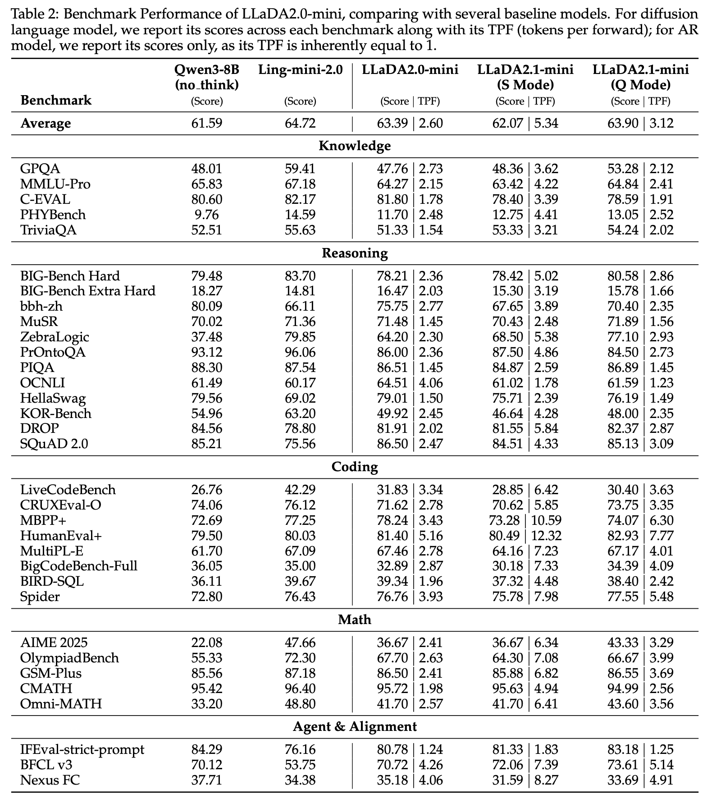

# 問題設定 (1)

- 離散拡散型のLLMは並列デコードで高速化できる一方、従来の absorbing-state（`[MASK]` から確定トークンへの単方向遷移）では、誤りが一度入ると修正しにくいという構造的な弱点がある
- 並列生成ではトークン間の不整合が局所的に増幅しやすく、速度を上げるほど品質が落ちるというトレードオフが支配的だった
- この論文の目的は、このトレードオフを制御可能にすること

---

# モチベーション (2)

- dLLM は理論上並列デコードで高速化できるが、ステップ数を減らすほど品質が落ちるため速度と品質を同時に上げることが難しい
- 従来の研究は confidence-based remasking や外部ガイド導入で品質を補おうとしたが、「一度確定したトークンを書き直せない」という遷移ルール自体は変わっていない
- この論文の問い：デコード中にトークンを編集できるようにすれば、速度と品質のバランスを運用者が選べるのではないか
- 編集可能な遷移を設計することで、速度優先と品質優先を同一モデルで切り替えられる仕組みを目指している

---

# 先行研究 (1)

- 先行の dLLM 改良はconfidence-based remasking, 外部ガイドモデル導入などで品質を改善してきたが、推論過程の基本遷移は「`[MASK]` を埋めるだけ」の枠内に留まっていた。
- 結果として、誤生成を後段で積極的に書き換える機構は弱く、速度と品質の両立を維持しにくい問題

---

# 新規性 (1)

**二重閾値で M2T と T2T を同時運用する editable decoding を導入し、dLLM の速度品質トレードオフを運用時に再構成できるように**
- Draft-and-Edit という編集可能デコードを設計し、S Mode と Q Mode を同一モデル上で切り替え可能にしました。
- CPT/SFT/RL まで一貫して M2T と T2T の混合学習を適用し、編集能力を学習目標として内在化しました。
- LLaDA2.1-Flash（100B）と LLaDA2.1-Mini（16B）で、33ベンチマークにおける品質とTPSの実測を提示しました。

---

# アイデア (2)

- まず高速に草案を生成し、次に同じデコード過程で誤りを編集する
- 編集を許すことで、初期ステップの高速・低品質な生成を後段で回収できる
- S Mode：低めの `τ_mask` で速度を優先し、T2T 編集で品質を整える
- Q Mode：保守的な閾値で品質を優先する

---

# 提案手法 (2)

時刻 `t` で予測上位トークンを `v_t^i = argmax_v p_\theta(v | x_t)` とすると、更新対象は次の2集合で定義されます。

$$
\Gamma_t = \{ i \mid x_t^i = [MASK],\ p_\theta(v_t^i \mid x_t) > \tau_{mask} \}
$$

$$
\Delta_t = \{ i \mid x_t^i \neq v_t^i,\ p_\theta(v_t^i \mid x_t) > \tau_{edit} \}
$$

$$
x_{t-1}^i =
\begin{cases}
v_t^i & \text{if } i \in \Gamma_t \cup \Delta_t \\
x_t^i & \text{otherwise}
\end{cases}
$$

- `Γ_t`：未確定箇所（MASK）を確定する集合
- `Δ_t`：既出トークンを再編集する集合
- 従来との差は `Δ_t` を明示的に持つことで、誤り修正を遷移ルールに組み込んだ点

---

# 方法：混合学習でDraftとEditを同時に育てる (3.1)

- 推論で Draft-and-Edit を使う以上、学習でも M2T と T2T を同時に見せる必要がある
- CPT と SFT の両方で Mixture of M2T and T2T objective を使い、生成能力と修正能力を同一パラメータ空間で整合させる
- さらに Multi-turn Forward（MTF）で編集シナリオの多様性を増やし、後段編集に必要な頑健性を持たせる

---

# 方法：EBPOでdLLMのRLを安定化する (3.2)

- dLLM の RL では系列尤度 `log π_θ(x)` の扱いが難しく、分散と計算量がボトルネックになる
- ELBO を代理目的に使う EBPO を採用し、ベクトル化した尤度推定で長文でも更新可能にした

$$
J_{\mathrm{EBPO}}(\theta)=\mathbb{E}\left[\min\left(\rho\hat{A},\ \mathrm{clip}(\rho,1-\epsilon_{low},1+\epsilon_{high})\hat{A}\right)\right]
$$

- PPO 型の比率クリップを保ちながら、dLLM 向けに尤度推定を実装可能な形へ落とし込んでいる

---

# 方法：推論基盤最適化で高TPSを実現する (4.2)

- カスタム SGLang による dLLM 推論実装
- Alpha-MoE megakernel で FusedMoE を統合
- per-block FP8 quantization で速度と精度のバランスを調整
- block-wise causal masked attention、radix caching、batching 対応で長文推論を高速化

---

# 実験設定 (5)

- 知識・推論・コーディング・数学・Agent/Alignment を含む33ベンチマークで評価
- Flash（100B）と Mini（16B）をそれぞれ比較
- 報告指標：品質スコア + dLLM 向けの `TPF`（tokens per forward）と `TPS`
- 比較軸：S Mode と Q Mode のトレードオフ / 量子化あり・なしの速度変化 / MBE（Multiple Block Editing）有無の品質・速度差

---

# 実験結果：FlashはQ Modeで平均スコアを更新する (5)

- LLaDA2.1-Flash：`S Mode 72.34 | TPF 5.93`、`Q Mode 73.54 | TPF 3.64`
- LLaDA2.0-Flash：`72.43 | TPF 3.08` → Q Mode で品質を上げつつ、S Mode で並列度を維持
- 同一モデルで TPS と品質を選べることが実験で裏付けられた

---

# 実験結果：Miniは運用モードで挙動が明確に分かれる (5)

- LLaDA2.1-Mini：`S Mode 62.07 | TPF 5.34`、`Q Mode 63.90 | TPF 3.12`
- LLaDA2.0-mini：`63.39 | TPF 2.60` → S Mode は並列性、Q Mode は品質回復を優先
- スケールが下がってもモード切替の意味が残り、提案法が Flash 固有ではないことを示している

---

# 実験結果：量子化でTPSをさらに押し上げる (5)

- 量子化後のピークTPS：Flash が HumanEval+ で `891.74 TPS`、Mini が `1586.93 TPS`
- 多くのベンチマークでスコアの変動は小さく、大きな TPS 改善が得られた
- S Mode は閾値設計だけでなく、量子化と組み合わせたときに最大化される

---

# アブレーション (5)

- MBE（Multiple Block Editing）を入れると、Flash/Miniともに複数ベンチマークでスコアが改善
- 平均では Flash が `70.69 -> 72.67`、Mini が `57.63 -> 58.24`
- 一方で `TPF` は低下し、編集回数増加に伴う速度コストが発生
    - 局所誤りの訂正を強めるほど品質が上がるが、そのぶん計算は重くなる

---

# 制限 (6)

- 論文自身も、速度と精度のトレードオフが依然として残ることを明確に認めている
    - TPS, 品質の同時最大化は不可能
- 特にタスク領域ごとの性能差が大きく、最適設定は一律ではない

---

# まとめ

- dLLM のデコード遷移に T2T 編集を組み込む Draft-and-Edit を提案し、速度と品質を閾値で選べるようにした
- M2T/T2T の混合目的を CPT・SFT・RL に一貫して適用し、編集能力をモデルに内在化している
- 33ベンチマークで S Mode（速度優先）と Q Mode（品質優先）を同一モデルで使い分けられることを確認
- 量子化と組み合わせることで Flash が最大 891 TPS、Mini が最大 1587 TPS を記録
- 速度と品質のトレードオフを「なくす」のではなく「制御できるようにする」という設計判断がこの論文の核心
