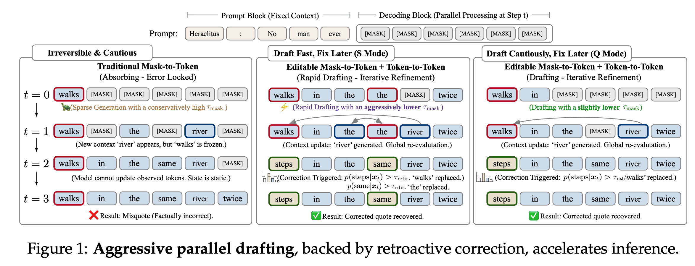
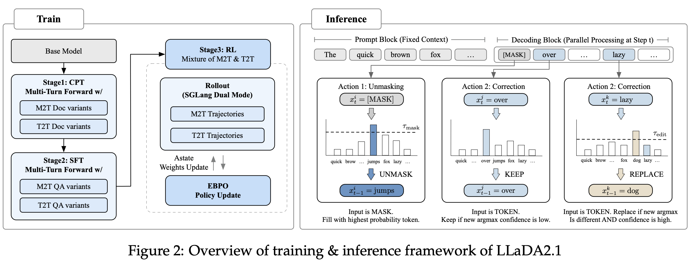
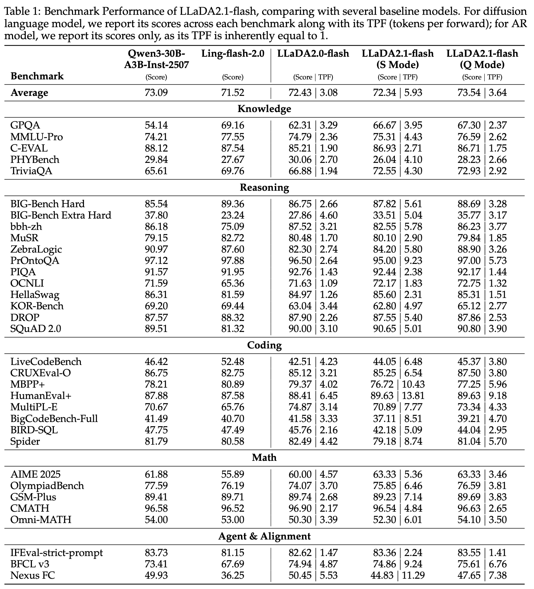
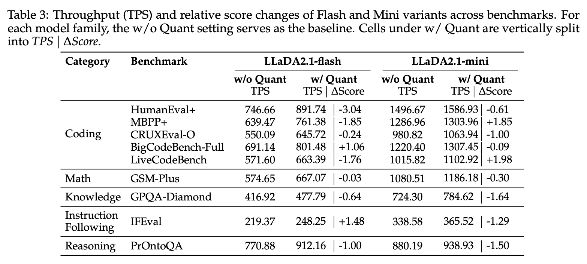
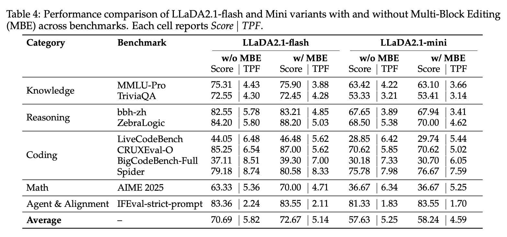

# 問題設定：なぜ速度と品質が両立しにくいのか (1)

従来の dLLM は並列生成できる一方で、並列に出た局所誤りが次のステップで自己増幅しやすく、結果として保守的な更新に寄って速度が落ちやすいという問題がありました。

吸収状態ベースの設計では `[MASK] -> token` の一方向遷移しか許されず、誤りを後から書き換える操作がないため、初期ドラフトのミスを引きずりやすい構造になります。

論文はこの点を「Exposure Bias と並列デコードの組み合わせが品質だけでなく速度も悪化させる」と整理し、編集操作の導入を中心解として置いています。

# 新規性：M2T に T2T 編集を組み込む (2)

LLaDA2.1 は従来の Mask-to-Token (M2T) に加えて Token-to-Token (T2T) を同じデコード過程に組み込み、生成中に誤りを遡及修正できるようにしています。

この設計により、低しきい値で粗いドラフトを高速に出しつつ、後続ステップで局所整合性を回復する運用が可能になります。

その結果として、同じモデルサイズでも S Mode と Q Mode という運用上の二つの人格を分けて扱える点が、LLaDA2.0 からの直接的な差分です。

# 図1の読み方：Draft-and-Edit が効く理由 (2)

この図が答えている問いは、「なぜ低しきい値でも破綻せずに高速化できるのか」です。

左側の従来 M2T では、一度出た誤りトークンを修正できずに固定しやすいのに対して、右側の Editable 方式では後続文脈を見た再評価で置換が発生します。

図の一文 takeaway は、初期ドラフトの誤りを許容しても、編集フェーズがあることで最終品質を回復できるため、しきい値を攻めた運用が可能になるという点です。

# デコード規則：2つのしきい値で遷移を決める (2)

まず直観としては、`τ_mask` が「[MASK] を確定トークンへ進める閾値」、`τ_edit` が「既存トークンを書き換える閾値」です。

$$
\Gamma_t = \{ i \mid x_t^i = [MASK],\; p_\theta(v_t^i \mid x_t) > \tau_{mask} \}
$$

$$
\Delta_t = \{ i \mid x_t^i \neq v_t^i,\; p_\theta(v_t^i \mid x_t) > \tau_{edit} \}
$$

$$
x_{t-1}^i =
\begin{cases}
v_t^i & i \in \Gamma_t \cup \Delta_t \\
x_t^i & \text{otherwise}
\end{cases}
$$

この形が有効な理由は、生成と修正を同じ更新則に乗せることで、速度制御と品質制御を閾値調整に還元できるからです。

# 学習設計：Mixture of M2T/T2T で推論と整合させる (3.1)

推論時に Draft-and-Edit を使うなら、学習時にも「生成する能力」と「編集する能力」を同時に学ばせる必要があります。

論文では CPT と SFT の両方で Mixture of M2T and T2T objective を適用し、マスク復元だけでなくノイズ混入トークンの修復も学習対象にしています。

この構成により、モデルは単なる穴埋め器ではなく、初稿作成者と校正者を同一重みで兼務する形になります。

# RL設計：EBPO で長文更新を現実化する (3.2)

ここでの狙いは、拡散モデルで扱いづらい系列 log-likelihood を ELBO 近似で置き換え、方策更新を計算可能にすることです。

$$
J_{\mathrm{EBPO}}(\theta) = \mathbb{E}_{x,y \sim \pi_{\theta_{old}}}
\left[\min\left(\rho(y\mid x)\hat{A},\;\mathrm{clip}(\rho(y\mid x),1-\epsilon_{low},1+\epsilon_{high})\hat{A}\right)\right]
$$

$$
\log \rho(y\mid x) \approx \sum_{n=1}^{N} w_n \sum_{b=1}^{B}
\left( \log p_\theta(y_b\mid z_n,x;M) - \log p_{\theta_{old}}(y_b\mid z_n,x;M) \right)
$$

変数 `M` は block-causal mask で、無効な未来参照を防いで並列計算と因果整合を両立させる役目です。

# 学習インフラ：再現時に必要な実装前提 (4.1)

CPT/SFT は LLaDA2.0 と同系統の訓練基盤を使い、追加で Multi-turn Forward を高速に回せる実装を入れています。

RL では AReaL 系ワークフローを拡張し、M2T/T2T の双方に対応した likelihood 推定と advantage 推定を使っています。

再現時の実務ポイントは、目的関数だけでなく「どの forward を何回回すか」のスケジューリングを先に固定することです。

# 推論インフラ：速度を出すための条件 (4.2)

推論系では SGLang のカスタム実装、Alpha-MoE、per-block FP8 quantization を併用して、MoE の実効スループットを押し上げています。

さらに block-wise causal masked attention と KV cache の設計を調整し、長文でも forward 回数を増やしすぎない構成を取っています。

この論文の速度主張はアルゴリズム単体ではなく、推論エンジン最適化を含めた system-level の主張として読む必要があります。

# 推論アルゴリズム：MBE の役割 (4.3)

基本設定では単一ブロック内で生成と編集を行いますが、MBE は既に生成済みの前ブロックにも再編集を許します。

これにより新しい文脈が得られた後で過去トークンを再評価できるため、局所最適の取り残しを減らしやすくなります。

代償として TPF は下がる傾向があるため、MBE は常時オンではなくタスク依存で切り替える設計が妥当です。

# 評価範囲：何を測っているのか (5)

評価は Knowledge、Reasoning、Coding、Math、Agent & Alignment の 5 軸で、合計 33 ベンチマークに跨っています。

論文は AR 系ベースラインと dLLM 系を混在比較し、dLLM 側には Score だけでなく TPF も併記して、品質と効率を同時比較できる形式にしています。

この設計により「高精度だが遅い」または「高速だが不安定」という片側評価を避けています。

# 主要結果：Flash 系での性能位置づけ (5)

Flash 系の表では、S Mode は TPF 向上が大きく、Q Mode は平均スコア側で LLaDA2.0 を上回る傾向が示されています。

論文内の代表値として、`MMLU-Pro` は 2.1 flash Q mode が 76.59、`HumanEval+` は 89.63、`AIME 2025` は 63.33 です。

読み方としては「S は高速寄り、Q は品質寄り」という役割分担が、単なる主張でなく表1全体に一貫して出ているかを確認するのが重要です。

# 速度結果：Quantization 後の TPS 改善 (5)

速度面では、S Mode で quantization を併用したときの TPS が特に大きく、論文では `HumanEval+ 891.74 TPS`、`BigCodeBench 801.48 TPS`、`LiveCodeBench 663.39 TPS` を報告しています。

重要なのは、TPS の上昇と同時にスコア差分 `ΔScore` も提示されており、速度の代わりに失った品質がどの程度かをタスクごとに確認できる点です。

実運用では、コードや数理のような構造化タスクで S Mode が効きやすく、一般対話は Q Mode へ寄せるのが論文の推奨です。

# MBE の効果：精度向上と TPF 低下の交換 (5)

Table 4 は MBE の有無比較で、たとえば Flash では `AIME 2025` が 63.33 から 70.00 に上がる一方で TPF は 5.36 から 4.71 へ下がっています。

この傾向は Coding/Reasoning でも概ね同様で、再編集の導入が局所誤り修正に効く代わりに、1 forward あたりの進行量を削る構図です。

したがって MBE は「品質を優先する区間だけオンにする」運用が実務上は合理的です。

# 限界と適用境界 (6)

論文自身が明示している通り、速度と精度のトレードオフは依然として残っており、しきい値設定を誤ると一般対話で不自然な出力が増える可能性があります。

特に `τ_mask` を攻めすぎる設定は粗い下書きを高速に出せる反面、初期構造が崩れると後段編集だけでは回復しきれないケースがあります。

このため本手法は「常に最速が正義」ではなく、タスク分布に応じて S/Q モードや MBE を切り替える運用設計が前提です。

# 4つの必須問いへの回答 (6)

1. What is new? 既存の M2T デコードに T2T 編集を統合し、しきい値制御で速度重視と品質重視を同一モデル内で切り替え可能にした点が新規です。
2. What can it do and what can it not? コード・数理では高速化の恩恵が大きい一方、一般対話では攻めた閾値設定で品質劣化が起きやすく、運用時のモード選択が必須です。
3. Under what conditions does it work? Mixture of M2T/T2T 学習、EBPO による RL、推論エンジン最適化（SGLang/Alpha-MoE/FP8）が揃った条件で速度と品質の両立が成立します。
4. What to know for reproduction? `τ_mask`, `τ_edit`, MBE のオンオフ、量子化設定、長文時の block-wise attention と cache 方針が再現性を左右する最重要パラメータです。

# Q&A準備：想定論点と返答方針 (6)

想定される弱点は三つで、第一に速度最適化が推論基盤依存である点、第二に一般対話での安定性、第三に閾値チューニングの運用負荷です。

最も強い証拠は二つで、第一に Table 3 の高 TPS と小さな `ΔScore`、第二に Table 4 で MBE が複数領域に一貫して効いている点です。

次の拡張案は一つで、RL の報酬側に編集品質指標を直接組み込み、S/Q のモード切替を固定ルールではなく動的ポリシーにする方向が有望です。
